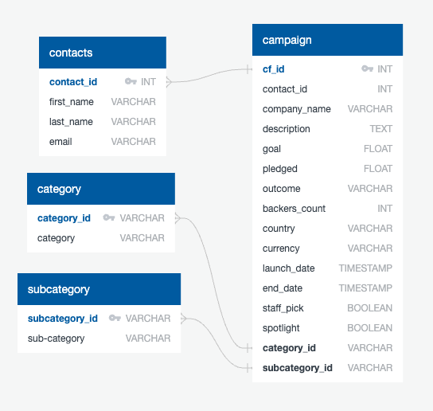
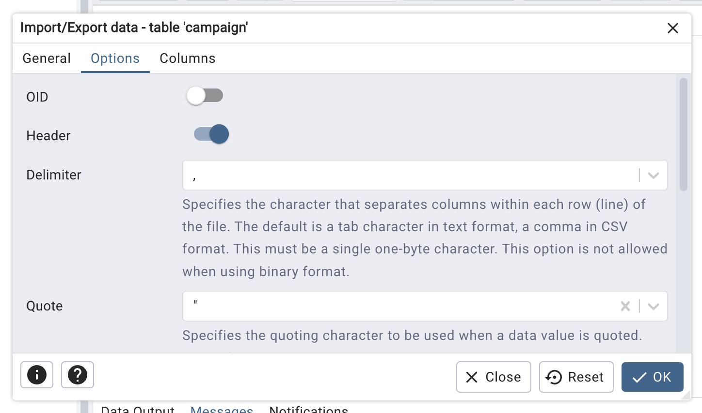

# Crowdfunding_ETL

## Project Overview

In this ETL mini-project, we built an ETL pipeline using Python, Pandas, and regular expressions to extract and transform crowdfunding campaign data. The project culminates in the creation of CSV files, a PostgreSQL database, and an Entity Relationship Diagram (ERD).

We worked collaboratively in a team to extract raw data from Excel files, transform it into cleaned DataFrames, and load it into a relational database. The final output includes a campaign table, category and subcategory tables, and a contacts table—all integrated into a cohesive relational structure.

---

## Table of Contents

- [Technologies Used](#technologies-used)
- [Repository Contents](#repository-contents)
- [ETL Pipeline Overview](#etl-pipeline-overview)
- [Database Schema & ERD](#database-schema--erd)
- [Tables Overview](#tables-overview)
- [Contributors](#contributors)

---

## Repository Contents

```
Crowdfunding_ETL/
│
├── Resources/
│   ├── campaign.csv
│   ├── category.csv
│   ├── contacts.csv
│   ├── subcategory.csv
│
├── Images/
│   └── crowdfunding_db_schema.png
│
├── Spreadsheets/
│   ├── crowdfunding.xlsx
│   └── contacts.xlsx
│
├── ETL_Mini_Project_ECrawley_KRatan_JPortnoy.ipynb
├── crowdfunding_db_schema.sql
└── README.md
```

---

## ETL Pipeline Overview

### 1. Category & Subcategory Extraction

- Extracted unique category and subcategory names from the `crowdfunding.xlsx` file.
- Assigned sequential IDs in the format `cat1`, `cat2`, … and `subcat1`, `subcat2`, …
- Exported as:
  - [`category.csv`](Resources/category.csv)
  - [`subcategory.csv`](Resources/subcategory.csv)

### 2. Campaign DataFrame

- Transformed the raw campaign data by:
  - Renaming fields (e.g., `blurb` to `description`)
  - Converting currency columns to `float`
  - Converting UTC timestamps to `datetime`
  - Merging category and subcategory IDs
- Exported as: [`campaign.csv`](Resources/campaign.csv)

### 3. Contacts DataFrame

- Used regular expressions to extract:
  - `contact_id`
  - `first_name`
  - `last_name`
  - `email`
- Exported as: [`contacts.csv`](Resources/contacts.csv)

---

## Database Schema & ERD

- Created ERD using QuickDBD  
  

- Created schema SQL file: [`crowdfunding_db_schema.sql`](Resources/crowdfunding_db_schema.sql)
  - Defined all table relationships, primary and foreign keys
  - Used `VARCHAR`, `INTEGER`, `DATE`, and `BOOLEAN` types where appropriate

- Imported all CSVs into the `crowdfunding_db` PostgreSQL database

- The files were imported into their respective tables in the following order to avoid foreign key constraints:
  - `contacts`
  - `category`
  - `subcategory`
  - `campaign`

NOTE: When importing [`campaign.csv`](Resources/campaign.csv), under the options tab of the import dialogue box, " needs to be selected for Quote to properly import the file.



---

## Tables Overview

| Table Name     | Description                                |
|----------------|--------------------------------------------|
| `campaign`     | Main campaign data with links to categories and contacts |
| `contacts`     | Cleaned contact info from the original dataset |
| `category`     | Unique top-level categories                |
| `subcategory`  | Detailed subcategories of campaigns        |

---

## Contributors

- [Elizabeth Crawley](https://github.com/eli-crawley)
- [Kanchan Ratan](https://github.com/kanchanratan1980)
- [Joe Portnoy](https://github.com/joeportnoy)